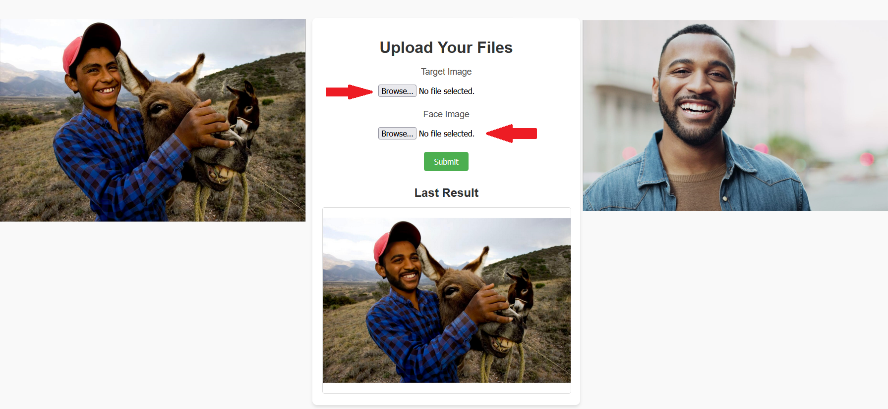

# Face Swap Web Application

**Face Swap** is a web-based application built with **Flask** for swapping faces between two uploaded images. It leverages **InsightFace** for face detection and swapping, providing a simple and intuitive interface for users to upload images and view the results in real-time.

## Features
- **Web Interface**: Upload two images directly via a browser.
- **Real-time Face Swapping**: Processes the images and swaps faces using InsightFace's `inswapper_128.onnx` model.
- **Output Display**: The swapped face image is displayed immediately on the webpage.
- **Automated Cleanup**: Input images are removed after processing.

## Prerequisites
1. **Python 3.8+**
2. **Flask** for the web interface
3. **InsightFace** for face detection and swapping
4. **CUDA-compatible GPU** (optional but recommended for performance)

### Install Dependencies
Install the required Python libraries:
```bash
pip install flask matplotlib opencv-python-headless insightface onnxruntime-gpu
```

## Running the Application

### 1. Clone the Repository
```bash
git clone https://github.com/SumDeusVitae/FaceSwap_v01.git
cd FaceSwap_v01
```

### 2. Start the Server
Run the Flask application:
```bash
python server.py
```

The server will start on `http://localhost:5000`.

### 3. Access the Web Interface
Open your browser and navigate to [http://localhost:5000](http://localhost:5000). 

### 4. Use the Application
1. Select **Target image** (where the face will be swapped) and a **face image** (the face to swap).
2. Submit the form.
3. View the result image displayed on the page.

## Demo


## File Structure
```
face_swap/
│
├── static/
│   └── images/
│       ├── background.jpg   # Uploaded background image
│       ├── face.jpg         # Uploaded face image
│       └── result.png       # Output swapped face image
├── templates/
│   └── index.html           # HTML template for the web interface
├── swap.py                  # Face swapping functionality
├── server.py                # Flask server script
├── requirements.txt         # Dependencies
└── README.md                # Documentation
```


## Customization
- **Change the Host/Port**:
  Edit the following line in `server.py`:
  ```python
  app.run(host='localhost', port=5000, debug=True)
  ```
- **Modify HTML Template**:
  The `index.html` template in the `templates` folder can be customized to improve the user interface.

## Notes
- Ensure that the `inswapper_128.onnx` model is accessible.
- The application uses Flask's development server, which is not suitable for production. Use a production-ready server (e.g., Gunicorn) for deployment.


## Acknowledgments
- **InsightFace**: [GitHub Repository](https://github.com/deepinsight/insightface)
- **Flask**: [Documentation](https://flask.palletsprojects.com/)

## License
This project is licensed under the MIT License. See the `LICENSE` file for details.
